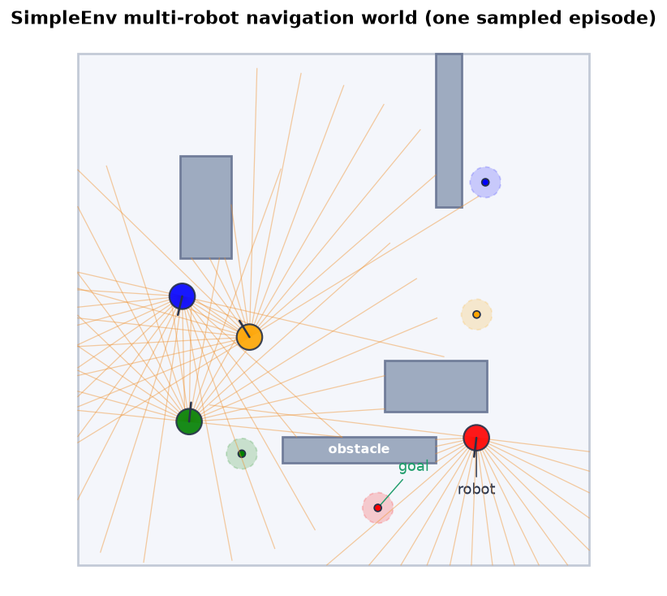
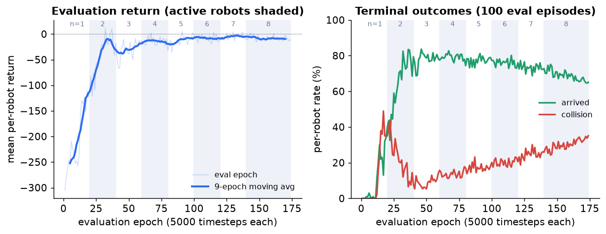

# Multi-Robot Navigation with a Shared TD3 Policy

[](https://github.com/nikswir/multiagent-navigation/actions/workflows/ci.yml)

A **TD3** (Twin Delayed DDPG) agent that learns collision-free point-to-point
navigation for **multiple robots at once**: a single **shared policy** drives
up to 16 lidar-equipped disc robots to individual goals in a bounded 2-D
world with rectangular obstacles. Each robot must avoid the obstacles, the
walls *and the other robots*, which it perceives only through its own lidar
— there is no communication channel. A **robot-count curriculum** ramps the
number of active robots up during training, so the policy first learns to
navigate alone and then to share the world.

<p align="center">
  
</p>

*One sampled episode: four robots (colored discs with lidar fans) heading to
their matching-colored goals. An animated demo GIF (`docs/assets/demo.gif`)
is produced by `report/scripts/make_gif.py` once a trained checkpoint exists
— see [Reproduce the experiment](#reproduce-the-experiment).*

## The task

A $10 \times 10$ bounded field, enclosed by walls, with four fixed
rectangular obstacles. At the start of **every** episode each active robot
gets a random collision-free start pose (position and heading) and its own
random goal, mutually separated from the other goals — so the policy cannot
memorize a route assignment. The episode ends per robot on goal arrival, on
any collision, or at the 500-step cap; finished robots freeze in place and
stay lidar-visible to the rest.

Each robot observes a **24-d state** — 20 normalized lidar ranges (a forward
half-circle fan; other robots occlude beams just like obstacles do) plus
four scalars about its own task:

$$
s = \big(\,d_1,\dots,d_{20},\;\tfrac{\rho_g}{L},\;
\tfrac{\Delta\phi}{\pi},\;v,\;\omega\,\big),
$$

with $\rho_g$ the distance to its goal ($L$ the world diagonal),
$\Delta\phi$ the **signed** heading error toward the goal, and $v, \omega$
its current velocities.

The **2-d action** is a throttle/steering pair $a \in [-1,1]^2$ through a
$\tanh$ output; the throttle is remapped to a forward-only velocity
$v = \tfrac{a_0+1}{2} \in [0,1]$, $\omega = a_1$, driving unicycle
kinematics with $\Delta t = 0.1$: $\theta \leftarrow \theta + \omega \Delta t$,
$x \leftarrow x + v\cos\theta\,\Delta t$,
$y \leftarrow y + v\sin\theta\,\Delta t$.

The reward is dense, with large terminal bonuses:

$$
r =
\begin{cases}
+100 & \text{goal reached } (\rho_g < 0.3),\\
-100 & \text{collision (obstacle, wall or another robot)},\\
\tfrac{v}{2} - \tfrac{|\omega|}{2} - \max(0,\,1 - d_{\min}) - 0.05 &
\text{otherwise,}
\end{cases}
$$

where the $d_{\min}$ term penalizes closing in on the nearest lidar reading.

## How it works

- **TD3** — a deterministic actor $\mu_\theta(s)$ (24 → 800 → 600 → 2, tanh)
  and a **twin critic** (two independent Q heads over the 26-d state–action
  pair), trained off-policy from a replay buffer. The target value takes
  $\min(Q_1, Q_2)$ over **smoothed target actions** (clipped Gaussian noise),
  and the actor + Polyak target networks update only every **2** critic
  steps.
- **Parameter sharing** — one policy is queried per robot on that robot's own
  observation, and every robot's transition lands in one shared replay
  buffer: $n$ robots means $n$ transitions per environment step.
- **Curriculum** — each episode draws its active robot count uniformly from
  $\{1,\dots,n_{\max}(t)\}$, with the cap ramping linearly from 1 to 8 over
  the first 800k of the 1M training timesteps: navigation is learned alone,
  interference is introduced gradually.
- **Exploration** — Gaussian action noise annealed from 1.0 to 0.1 over the
  first 500k timesteps.

## Results

All numbers come from the curated evaluation log of the training run
([report/assets/TD3_simpleEnv.json](report/assets/TD3_simpleEnv.json): 174
epochs, one per 5000 timesteps, each averaging 100 deterministic evaluation
episodes; the evaluation robot count follows the curriculum). Per-robot
rates:

| Training window                        | Robots | Arrived    | Collision | Timeout |
| -------------------------------------- | ------ | ---------- | --------- | ------- |
| best single epoch (46, by arrival)     | 3      | **83.7 %** | 6.7 %     | 9.7 %   |
| final 20 epochs (mean)                 | 8      | **67.4 %** | 31.7 %    | 0.9 %   |

(The replay tool picks its "best" epoch by average evaluation reward —
epoch 32 in this log; the table's headline row is the best epoch by arrival
rate.) Navigation is mastered early — arrivals peak above 80 % while 2–3
robots are active; the drop at 8 robots is absorbed almost entirely by
robot–robot collisions — coordination, not navigation skill, is the binding
constraint.



The full write-up — problem formalization, method and experiments — is in the
[report PDF](https://github.com/nikswir/multiagent-navigation/releases/download/report/main.pdf),
compiled by CI from [report/main.tex](report/main.tex) on every change.

## Quickstart

```bash
uv sync
uv run pre-commit install
```

## Usage

Runs are configured with [Hydra](https://hydra.cc): each run is composed from
config groups under `configs/` and written to its own output directory.

Train with the default config:

```bash
uv run python -m multiagent_navigation.run
```

Compose a run — pick options, override any field:

```bash
uv run python -m multiagent_navigation.run \
    train.n_robots=2 \
    train.max_timesteps=200000
```

Print the composed config without running, or sweep with `--multirun`:

```bash
uv run python -m multiagent_navigation.run --cfg job
uv run python -m multiagent_navigation.run --multirun train.seed=1,2,3
```

Replay the best checkpointed epoch (highest average evaluation reward) as a
live animation, dumping a per-step state CSV. The run to replay is resolved
automatically — a CWD-relative `results/` layout first, else the newest
Hydra `outputs/` run — or pinned explicitly with `animate.run_dir`:

```bash
uv run python -m multiagent_navigation.viz animate.n_robots=4
uv run python -m multiagent_navigation.viz animate.run_dir=outputs/DATE/TIME
```

### Configuration groups

```text
configs/
├── config.yaml        # the `defaults` list that composes a run
├── env/     default   # world geometry, lidar, obstacle course, capacity
├── model/   default   # network sizes, learning rates, TD3 update knobs
├── train/   default   # timesteps, buffer, curriculum, exploration decay
└── animate/ default   # playback robots, steps, artifact paths
```

Add a variant by dropping a file into a group (e.g.
`configs/train/short.yaml`) and select it with `train=short`.

### From Python

```python
import torch

from multiagent_navigation import Config, train

result = train(Config(), device=torch.device("cpu"))
result.agent         # trained TD3 agent (shared actor / twin critic)
result.evaluations   # per-epoch evaluation records
```

## Reproduce the experiment

```bash
uv run python report/scripts/run_experiment.py  # train + save checkpoint & log
uv run python report/scripts/eval_policy.py     # rates over 100 fresh episodes
uv run python report/scripts/make_figures.py    # regenerate report figures
uv run python report/scripts/make_gif.py        # rebuild the README demo GIF
```

Set `MAN_DEVICE=cpu` to force the device (recommended on Apple Silicon) —
every entry point (`run`, `viz` and the report scripts) resolves the device
the same way: `MAN_DEVICE` override, else CUDA → MPS → CPU.

Note: `.gitignore` excludes `*.pth` globally, so the curated checkpoint that
`run_experiment.py` writes to `report/assets/` must be staged explicitly with
`git add -f report/assets/*.pth`. The other curated asset is the real
training log `TD3_simpleEnv.json` (the 8-robot run behind the figures and
the Results table).

## Layout

```text
src/multiagent_navigation/
├── environment.py     SimpleEnv: world, lidar robots, per-robot rewards
├── agent.py           TD3: actor / twin critic, delayed updates
├── replay_buffer.py   uniform experience replay
├── lib.py             library API: Config -> TrainResult (curriculum loop)
├── run.py             Hydra CLI entry point
├── viz.py             live animation + vector drawing helpers
└── config_schema.py   typed structured-config schema
configs/               Hydra config groups
tests/                 stage-1 CPU tests (+ stage-2 gate)
tools/                 pre-commit style checks, mutation-test helpers
report/                LaTeX report, figures, scripts, curated artifacts
```

## Development

The engineering workflow — toolchain (uv), the pre-commit gate, two-stage
tests, CI — is documented in [AGENTS.md](AGENTS.md). Common tasks: `just lint`,
`just test` — run `just` for the list.

```bash
uv run pre-commit run --all-files   # lint, format, types, style checks
uv run pytest                       # stage-1 (fast, CPU) tests
RUN_STAGE2=1 uv run pytest          # + heavy tests
```

See [docs/architecture.md](docs/architecture.md) for how a training run flows
through the package.

## License

MIT — see [LICENSE](LICENSE).
