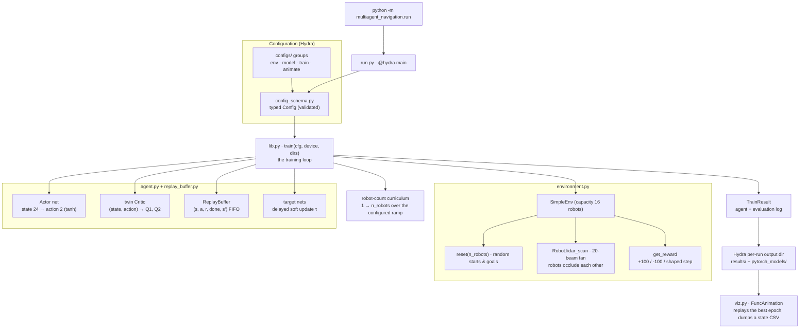

# Architecture

How a training run flows through the package, from the Hydra entry point to
the checkpoints the animation replays. Each node names the module that owns
it; GitHub renders the diagram below natively (no build step). Keep it in
sync by hand when the pipeline changes — it is a map, not a generated
artifact.

## The flow

- **`run.py`** is the CLI entry only — `@hydra.main` composes the config from
  `configs/`, validates it against the typed schema, picks the device via
  `lib.select_device` (`MAN_DEVICE` override, else CUDA → MPS → CPU) and
  routes both output dirs through Hydra's per-run output directory.
  Importing the package never imports it.
- **`config_schema.py`** declares the typed `Config`: the `env` group (world
  geometry, lidar, obstacle course, robot *capacity*), `model` (TD3 network
  sizes and update hyper-parameters), `train` (schedule, exploration decay,
  curriculum cap, checkpoint naming) and `animate` (playback and artifact
  paths).
- **`lib.py`** owns the training loop: it builds `SimpleEnv`, `TD3` and the
  `ReplayBuffer` from the config, ramps the active robot count (curriculum),
  decays exploration noise at runtime, trains after every episode, and every
  `eval_freq` timesteps evaluates the policy and writes the shared checkpoint
  contract — the JSON log `{results_dir}/{file_name}` and weights
  `{models_dir}/{file_name}_epoch-{N}`. The state dimension is *derived*:
  `environment_dim + 4`.
- **`environment.py`** holds `SimpleEnv`: a bounded world with rectangular
  obstacles and wall bounds, up to `max_robots` (capacity 16) disc robots
  with unicycle kinematics. Each robot's 20-beam half-circle lidar sees
  obstacles *and the other robots*; the 24-d state adds normalized goal
  distance/angle and the robot's velocities. Episodes end per robot on goal
  arrival, collision or the step cap; `get_reward` is the fixed pure reward.
- **`agent.py`** holds TD3: the tanh-bounded **Actor**, the **twin Critic**,
  hard-copied target networks with delayed (`policy_freq`) Polyak soft
  updates, clipped smoothing noise on target actions, and device-agnostic
  checkpoint save/load. **`replay_buffer.py`** is the FIFO experience replay
  storing `(s, a, r, done, s')` — done *before* next-state.
- **`viz.py`** replays a trained run: it reads the same results log, picks
  the best epoch by average reward, loads those weights and animates the
  shared policy for `animate.n_robots` robots, dumping every robot's per-step
  state to a CSV for offline analysis.

The public surface (`__all__` in `__init__.py`) is the training entry,
result and config types plus the domain classes, re-exported from their
modules; `test_api_stability.py` pins the contract so it can't drift
silently.
